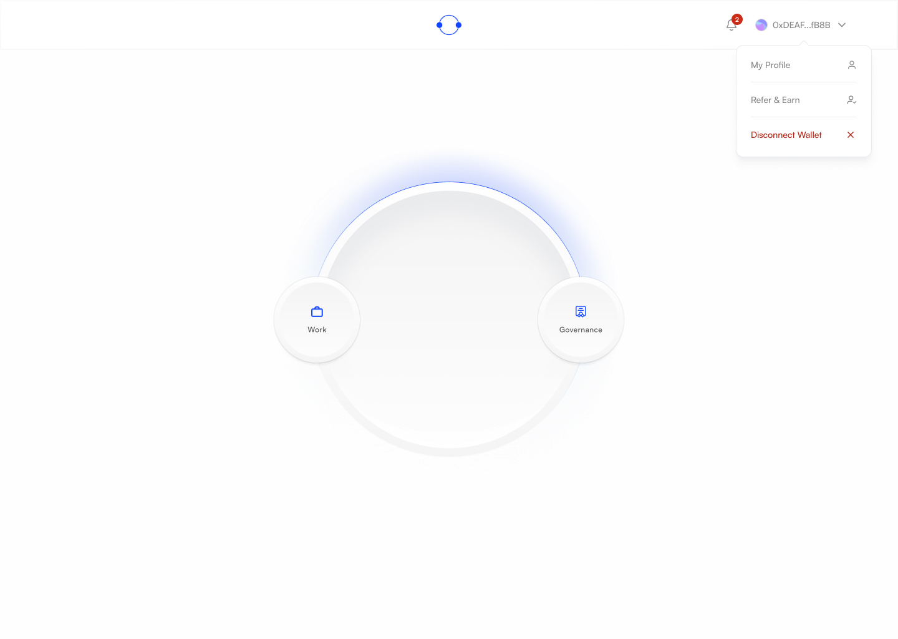
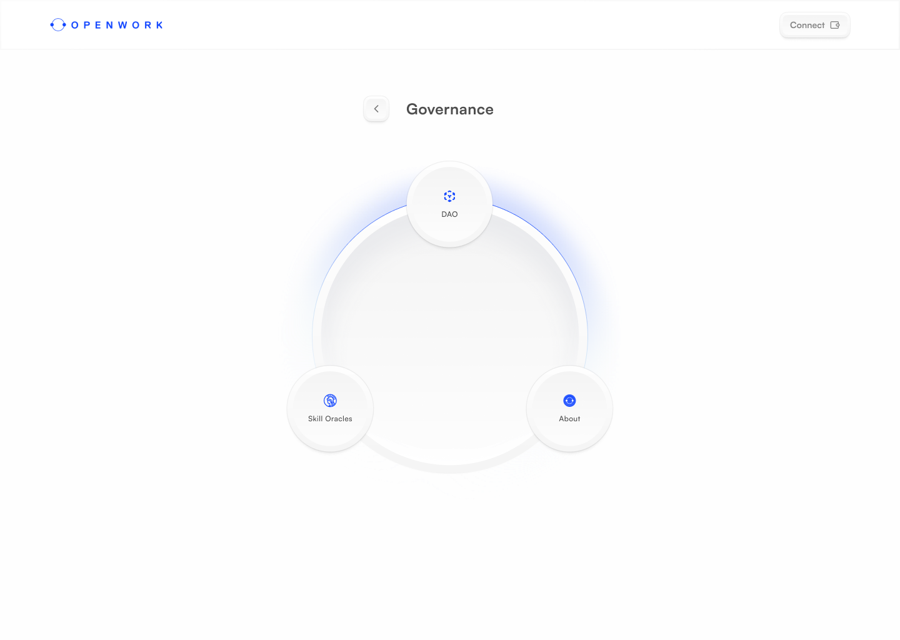
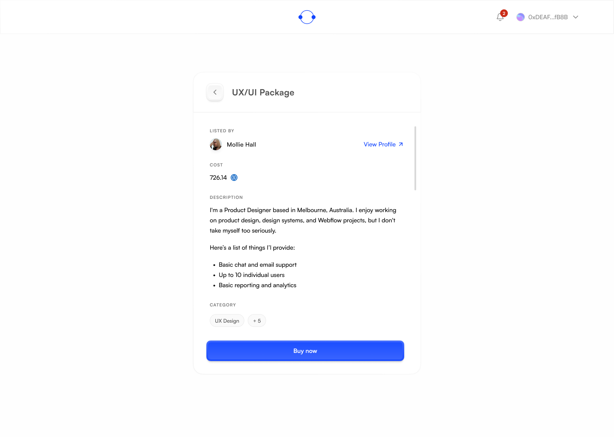

# Figma vs Live — Design Comparison
**Last updated:** 2026-03-04  
**Figma file:** [OpenWork — Final UI](https://www.figma.com/design/pgepy6ynoBsaiHDfQv3Ior/OpenWork?node-id=1-6)  
**Live app:** https://app.openwork.technology  
**Test device:** MacBook Air M1 (1440 × 900px screen, ~820px usable page height after browser chrome)

---

## ⚠️ Important: Screenshot Methodology

> Screenshots taken by the AI agent use a **narrow browser viewport (~780px wide)**,  
> which makes the radial menu appear disproportionately large.  
> **All visual assessments use Anas's actual MacBook Air M1 screenshots** as the live reference,  
> not the agent's browser captures.

---

## Viewport Reality Check

| | Figma Design | MacBook Air M1 (Live) |
|---|---|---|
| Canvas width | 1440px | 1440px ✅ |
| Canvas height | 1024px | ~820px usable (900px screen − browser chrome) |
| Height gap | — | **−204px** |
| Aspect ratio | 1440:1024 (1.41:1) | 1440:820 (1.76:1) |

**Consequence:** anything positioned in the bottom ~200px of the Figma canvas may be clipped or require scrolling on a MacBook Air M1.

---

## Home Screen

### Figma Design

### Assessment vs MacBook Air M1

| Element | Figma | Live (M1) | Status |
|---------|-------|-----------|--------|
| Radial hub size | ~500px diameter, centered vertically | Slightly clipped at bottom | ⚠️ Minor |
| 3 radial nodes visible | Top + lower-left (Work) + lower-right (Governance) | All 3 visible per Anas | ✅ |
| Blue radiant glow | Strong arc at top of hub | Present but slightly softer | ⚠️ Minor |
| Background | Pure white | Pure white | ✅ |
| Header layout | Logo center-top | OpenWork logo center-top | ✅ |
| Header — left | OpenWork wordmark | Chain name (e.g. "Optimism") | ⚠️ Different |
| Header — right | Wallet address + caret | Wallet address + caret | ✅ |
| "Hover to get started" label | Visible inside hub | Visible inside hub | ✅ |
| Overall proportions at 1440px | Designed baseline | Correct proportions | ✅ |

**Verdict:** Home screen is largely faithful to design at 1440px width. The main differences are:
1. **Bottom clipping** — hub sits ~20px below fold on 900px screens. Low priority — doesn't break UX.
2. **Header left element** — Figma shows OpenWork wordmark; live shows chain selector. Functional decision, worth a design discussion.
3. **Glow intensity** — slightly softer on live. CSS tweak if desired.

---

## Browse Jobs

### Figma Design

### Assessment vs MacBook Air M1

| Element | Figma | Live | Status |
|---------|-------|------|--------|
| Table layout | Full width, left-aligned content | Left-aligned, no clipping | ✅ (fixed) |
| Column headers | Job Title, Chain, Skills Required, Job Status | Job Title, Chain, Skills Required, Job Status | ✅ |
| Row data | Job cards with chain badge + tags | Showing correctly | ✅ |
| Pagination | Bottom of table | Present | ✅ |

---

## Key Design Rules (from Figma)

From studying the Final UI file:

1. **Design baseline is 1440 × 1024px** — all frames are this exact size
2. **Radial menu (home)** uses 3 nodes at ~120° spacing on an arc around a ~500px hub
3. **Hub styling** — soft white gradient, blue radiant glow arc at top, thin rim stroke
4. **Node styling** — white face, inner bezel, soft shadow, bright blue icon + label
5. **Header** — slim ~64px bar: logo/chain left, OpenWork mark center, wallet right
6. **Color palette** — pure white bg, azure blue (#2B7BFF–#4A86FF) accents, mid-gray labels
7. **Tables** — left-aligned content, full-width, filter/column controls top-right
8. **Forms** — 456px wide centered panels
9. **Typography** — Satoshi font family throughout

---

## Methodology: How Agent Compares Figma vs Live

1. **Export Figma frame** → `GET /v1/images/{fileKey}?ids={nodeId}&format=png&scale=1` → download PNG
2. **Get live screenshot** → browser tool on actual URL (note: agent browser = ~780px viewport, use Anas's screenshots for accurate M1 assessment)
3. **Get design specs** → `GET /v1/files/{fileKey}?depth=N` → parse `absoluteBoundingBox` for dimensions
4. **Analyze gaps** → compare layout, proportions, colors, missing elements
5. **Document findings** → update this file

---

## Pages Not Yet Compared

| Page | Figma Section | Priority |
|------|--------------|----------|
| Profile view | Final UI → View Profile | High |
| Single Job Details | Final UI → View Job - Job Giver | High |
| Post Job | For Anas → Post a Job | High |
| Apply for Job | For Anas → Apply for a job | High |
| DAO | Final UI → Manage DAO | Medium |
| Skill Oracle | Final UI → Skill Oracle | Medium |
| Browse Talent | Final UI → Browse Jobs/Talent | Medium |

---

*This document is updated as comparisons are done. Ping the agent to run a comparison on any specific page.*
